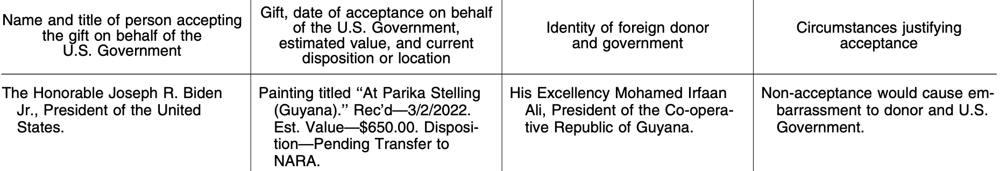
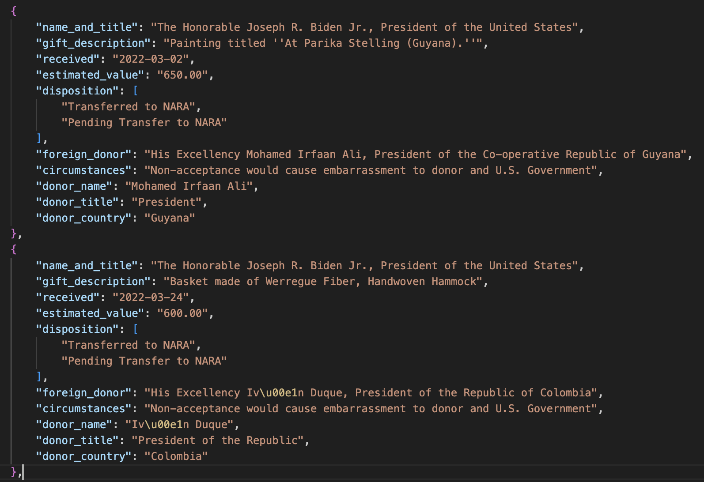

# LLM Playground with R and ellmer

This notebook demonstrates how to interact with Large Language Models using the `ellmer` package in R (<https://ellmer.tidyverse.org/>). We'll explore text generation, structured data extraction, and various AI capabilities.

## Setup

You'll need to set up your Groq API key. Get one from <https://console.groq.com/keys>, creating an account if you need to, and then set it as GROQ_API_KEY=<your key> (no quotes needed) in your .Renviron file using `usethis::edit_r_environ()`. Do the same thing for Google at <https://aistudio.google.com/apikey>, setting the key as GOOGLE_API_KEY=<your google key>. Restart R for them to take effect.

Then, let's install and load the necessary packages:

```{r setup, include=FALSE}
knitr::opts_chunk$set(echo = TRUE, warning = FALSE, message = FALSE)
```

```{r install-packages, eval=FALSE}
# Install required packages
install.packages(c("httr", "jsonlite", "rvest"))
```

```{r load-packages}
library(tidyverse)
library(lubridate)
library(ellmer)
library(httr)
library(jsonlite)
library(rvest)
```

### Testing Out Groq Using Llama 4

We'll use one of Groq's recent additions, the Llama 4 Scout model from Meta. In ellmer, you construct a chat object like this. You can provide a system prompt to help with overall guidance.

```{r groq-setup}

# Set the model
chat <- chat_groq(
  model = "meta-llama/llama-4-scout-17b-16e-instruct"
)

chat$chat("Give me 20 names for a pet sloth")

```

## How Newsrooms are Using LLMs

Let's take a look at the following piece: [How ProPublica Uses AI Responsibly in Its Investigations](https://www.propublica.org/article/using-ai-responsibly-for-reporting)

## Text Models and Summarization

Let's start with this [Nieman Lab piece](https://www.niemanlab.org/2025/02/meet-the-journalists-training-ai-models-for-meta-and-openai/) - read that. Then we'll load the text:

```{r read-article}
article_text <- readLines("nieman_lab.txt", warn = FALSE)
```

And then we'll have Llama 4 summarize it:

```{r summarize-article}

chat$chat(paste(
    "Summarize this story in 3 paragraphs:",
    article_text)
)
```

Compare this summary to the original article. How well did the LLM capture the key points?

## Structured Data Extraction

Ellmer does support the production of structured output (data), but Groq doesn't yet, so we're going to do things the old-fashioned way. Let's work with some descriptions of Maryland attorney sanctions and convert it to JSON that we can then turn into a dataframe:

```{r load-sanctions-data}
# Read the sanctions text file
sanctions_text <- readLines("sanctionsfy25.txt", warn = FALSE)
sanctions_content <- paste(sanctions_text, collapse = "\n")

# Display first few lines
cat("Sanctions data preview:\n")
cat(paste(head(sanctions_text, 10), collapse = "\n"))
```

```{r extract-structured-data}
# Create prompt for structured data extraction
structured_response <- chat$chat(paste(
  "produce only a list of JSON objects based on the supplied text with the following keys: name, sanction, date, description.",
  "The date should be in the yyyy-mm-dd format. Do not include any introductory text, no yapping.",
  "\nText:",
  sanctions_content
))


# Display the response
cat("Structured Data Response:\n")
cat(structured_response)
```

Then we can turn it into tidy data:

```{r parse-json-data}
# Parse the JSON response

sanctions_df <- fromJSON(structured_response) |>
  as_tibble() |>
  mutate(date = ymd(date))

```

How well did the LLM perform on this data extraction task? How should we evaluate it?

## Semi-Structured Data, and More of It

Groq's open models, like Llama, have limits on how much information you can provide to them. If you have a lot of text, such as [this example of foreign gifts given to U.S. officials](https://raw.githubusercontent.com/dwillis/all-foreign-gifts-around-us/refs/heads/main/text/2024-31509.txt), Google's Gemini models are a better solution because they have a much larger "context window", meaning they can accept (and work with) a lot more input material. Google also allows you to upload documents such as PDFs.

We'll be working with listings from the Federal Register describing gifts given to U.S. government officials by officials from foreign governments. Turning this:



Into something like this:



Setting up a Gemini chat with ellmer is similar to what we did with Groq: there's a specific function and we supply the model.

```{r}

gemini_chat <- chat_google_gemini(model="gemini-2.5-flash-preview-04-17")

text <- readLines("foreign_gifts.txt")

gifts_response <- gemini_chat$chat(paste(
  "produce only a list of JSON objects based on the supplied text with the following keys: name_and_title, gift_description, date, value, foreign_donor, circumstances",
  "The date should be in the yyyy-mm-dd format. Do not include any introductory text, no yapping.",
  "\nText:",
  text
))

```


## Vision Models (Image Analysis)

Groq currently supports a few multimodal models, including the two from Llama 4 models from Meta. You can pass local images or image URLs to it using the `content_image_file()` and `content_image_url()` functions from ellmer. Take a look at the `md_doc.png` file in this repository.

```{r vision-setup}

image <- content_image_file("md_doc.png")

license_number <- chat$chat("what is the license number from this image?", image)

```

Text extraction is hard, and for complicated jobs, you definitely need to check the results. We'll use an image of Black population figures by city from 1930. Check those results and compare them to the image in this repository.

```{r}

black_pop <- content_image_url("https://raw.githubusercontent.com/dwillis/llm-djnf25/refs/heads/main/BlackPop1930.png")

extract_csv <- chat$chat("Extract all of the information in this image into a CSV file, preserving the rows and columns and ensuring accuracy", black_pop)

```


Compare that to how Gemini does (we'll need to upload the image first using the `google_upload()` function):

```{r}
black_pop <- google_upload("BlackPop1930.png")

extract_csv_gemini <- gemini_chat$chat("Extract all of the information in this image into a CSV file, preserving the rows and columns and ensuring accuracy", black_pop)
```


### Your Turn: Find an image from the web and ask Llama 4 a question about it using `content_image_url()`

```{r}
friend_photo <- content_image_url("https://pbs.twimg.com/media/GT_VbudWAAIQN9x?format=jpg&name=large")

extract_csv <- chat$chat("What are the hair colors of each person in this photo?", friend_photo)

```

How well did the vision model perform on your image?

### Audio Models

Another option is to use models that transcribe audio. Download and listen to [this mp3 file](https://dare.wisc.edu/audio/new-mexico-chuck-wagon-etiquette/) from the Dictionary of American Regional English project at the University of Wisconsin. Then, in Groq's dev console, change the model to `distil-whisper-large-v3-en` and upload the mp3 file using the "Select File" button. Then hit submit and check out the transcript. How did the LLM do compared to the original transcript?
